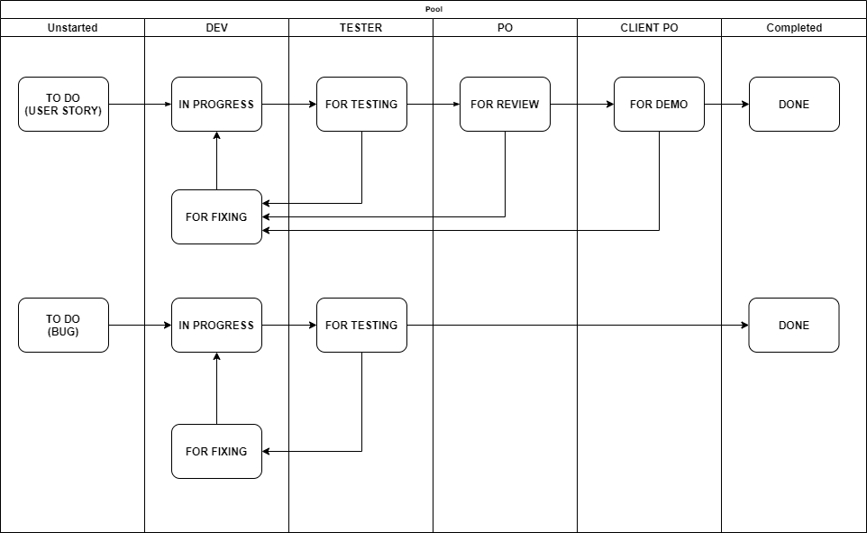

# Team Processes

*Description of the team's Agile Scrum Practices. As a separate, optional reading, have team members go through [The Scrum Guide](https://www.scrumguides.org/scrum-guide.html).*

## Scrum Values

> When the values of commitment, courage, focus, openness and respect are embodied and lived by the Scrum Team, the Scrum pillars of transparency, inspection, and adaptation come to life and build trust for everyone. The Scrum Team members learn and explore those values as they work with the Scrum events, roles and artifacts.

## Scrum Team

  * Product Owner
  * Scrum Master
  * Development Team

## Scrum Events

  * Sprint Planning
      * Required: Scrum Team
      * Duration: 6 hours
  * Daily Scrum
      * Required: SM, Team
      * Optional: PO
      * Duration: 15 mins
  * Sprint Review
      * Required: Scrum Team, Stakeholders
      * Duration: 3 hrs
  * Sprint Retrospectives
      * Required: SM, Team
      * Optional: PO
      * Duration: 3 hrs

## Processes and Workflows

### Release Planning

  * SM facilitates the Release Planning.
  * Client PO and Scrum Team work together on user story mapping.
  * Output: Prioritized epics and user stories, to be used by PO/Team in creating user stories

### Backlog Refinement

  * PO and Team sets aside time for backlog refinement to prepare for Sprint Planning.
  * Optional: Client PO is included in backlog refinement. Otherwise, PO serves as Proxy.
  * Output: User Stories in the Product Backlog to be discussed in the Sprint Planning

### Sprint Planning

  * SM facilitates the Sprint Planning.
  * PO shares the goal in mind, highlighting if there are any expectations of or demos to Stakeholders.
  * PO/BA discusses the user stories. Team sizes the user stories using poker planning.
  * Team raises if there are other user stories for tech backlog items or retrospective items that need to be handled in the sprint.
  * PO and Team agrees on the sprint goal and the user stories to be included in the Sprint.
  * SM notes the team's availability during the sprint, also highlighting any holidays.
  * Team creates tasks for the user stories and identifies who will do what.
  * Output: Items captured in the [Sprint Info Page](sprints/sprint-info-template.md), and initial numbers in the [Sprint Data Page](sprint-data.md)

### Daily Scrum

  * SM facilitates the Daily Scrum.
  * SM/Team finalizes on which approach to use -- [Person-by-person or story-by-story](https://www.mountaingoatsoftware.com/blog/should-the-daily-standup-be-person-by-person-or-story-by-story).

### User Story Workflow

  

  * PO creates user stories into the Product Backlog. Team can also create user stories and align it with PO.
  * PO and Team refines user stories during Backlog Refinement, and through other needed ad hoc discussions.
  * Team sizes and creates plans (through tasks and identification of owners) for the implementation of the user stories during Sprint Planning.
  * At the start, user story state is ```TO DO```.
  * Once the Team starts working on the user story, it's updated to ```IN PROGRESS``` usually by the Dev.
  * Once the Dev confirms that it's ready for testing in the TEST environment, Dev updates state to ```FOR TESTING```.
  * Once the Tester confirms that it's ready for review in the TEST environment, Tester updates state to ```FOR REVIEW```.
      * Testers assess bugs they find while testing the user story.
      * If acceptance criteria can't be met, depending on how big the user story is, they can either just track via the user story OR create a Bug Report.
      * Bug Reports are assigned to the Dev working on the user story. No need to size them. They follow a similar workflow, except that it doesn't need to go to the PO for review.
      * If the Team is on the fence about the bug found, they can discuss. Outcomes could be: align not to fix, OR create a bug report for it to be fixed within the Sprint, OR create a new user story for it in the product backlog.
      * If user story has bugs to be fixed, Tester sets state to ```FOR FIXING```. Bugs will need to be fixed by Dev and verified by Tester to mark the bug as ```DONE```.
  * Once the PO accepts the user story, the state is updated to ```FOR DEMO```. Note that the PO can either review the user story directly in the provided environment, or request the team to demo it to her.
      * If it's not OK, Team can: create a bug report for it to be fixed within the Sprint, OR create a new user story in the product backlog.
      * If user story has bugs to be fixed, PO sets state to ```FOR FIXING```. Bugs will need to be fixed by Dev and verified by Tester, and regression testing has to be done by the Tester before passing back to PO ```FOR REVIEW```.
  * PO arranges for a demo to the Client PO to cover the user stories that are already ready for demo. *This is not limited to the Sprint Review at the end of the sprint.*
  * Once the Client PO accepts the user story, the state is updated to ```DONE```. Similar to the when the PO reviews the user story, state can be reverted back to ```FOR FIXING``` if there's an item that needs to be handled within the sprint.

### Sprint Review

  * SM facilitates the Sprint Review.
  * Check against the Sprint Goal -- what was and wasn't accomplished.
  * Team recaps user stories that were demoed to the Client PO, and uses this time to conduct any other needed demos.
  * Team can also conduct demo of the completed user stories to other Stakeholders for feedback.
  * Output: Updates to the [Sprint Info Page](sprints/sprint-info-template.md) and [Sprint Data Page](sprint-data.md)

### Sprint Retrospective

  * SM facilitates the Sprint Retrospective.
  * Output: Action items for improvement, Retro notes in the [Sprint Info Page](sprints/sprint-info-template.md)

### Project Reporting

  * SM facilitates a regular touch base with the Stakeholders. *Finalize cadence.*
  * SM prepares a regular project status report emailed to Team and Stakeholders. *Finalize cadence.*
  * Output: Meeting Minutes, Project Status Report pages and emails
